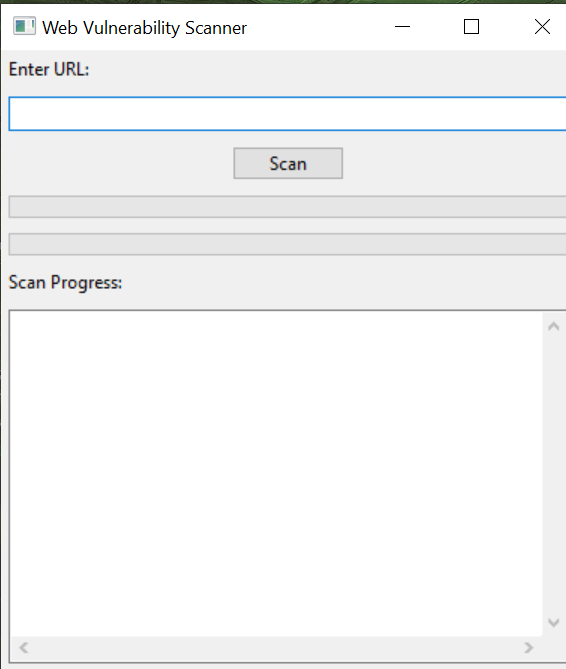
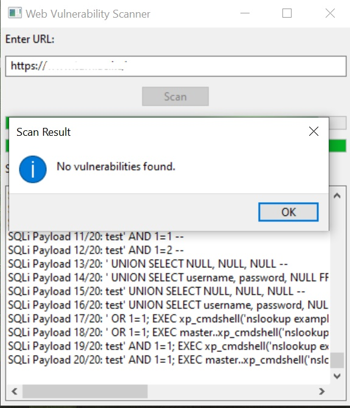

# Web Vulnerability Scanner

A simple web vulnerability scanner built using Python and wxPython GUI library.

## Description

This project is a web vulnerability scanner that helps identify potential security vulnerabilities in web applications, specifically targeting Cross-Site Scripting (XSS) and SQL Injection vulnerabilities. The scanner allows users to enter a URL and performs scans for both XSS and SQL Injection vulnerabilities. It provides a graphical user interface (GUI) to interact with and visualize the scanning process.

## Features

- Cross-Site Scripting (XSS) Vulnerability Scanning
- SQL Injection Vulnerability Scanning
- User-friendly GUI using wxPython
- Progress bars for scan visualization
- Display of scan results with details

## Screenshots

## Installation

1. Clone the repository:
git clone https://github.com/Ianemwel679/web-vulnerability-scanner.git

2. Navigate to the project directory:
cd web-vulnerability-scanner

3. Install the required dependencies:
wxPython

## Usage

1. Run the scanner:
python webvulscan.py

2. Enter the URL of the target web application in the GUI.
3. Click the "Scan" button to start the vulnerability scanning process.
4. The scanner will perform scans for XSS and SQL Injection vulnerabilities.
5. The console will display scan progress and results.
6. A message box will show the scan results after completion.

## Enhancements

- Added progress bars to show scan progress.
- Styled the GUI using wxPython's features.
- Provided options to save scan results to a file.

## Contributing

Contributions are welcome! If you find any issues or have ideas for improvements, feel free to submit a pull request.

## License

This project is licensed under the MIT License - see the [LICENSE](LICENSE) file for details.

## Acknowledgments

- [OWASP Cheat Sheet](https://owasp.org/www-community/attacks/) for providing payloads and guidance on vulnerabilities.

## Contact

For questions or feedback, please contact [your@email.com](mailto:ianemwel679@gmail.com).

